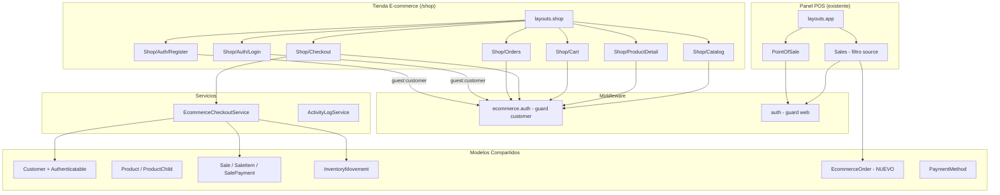
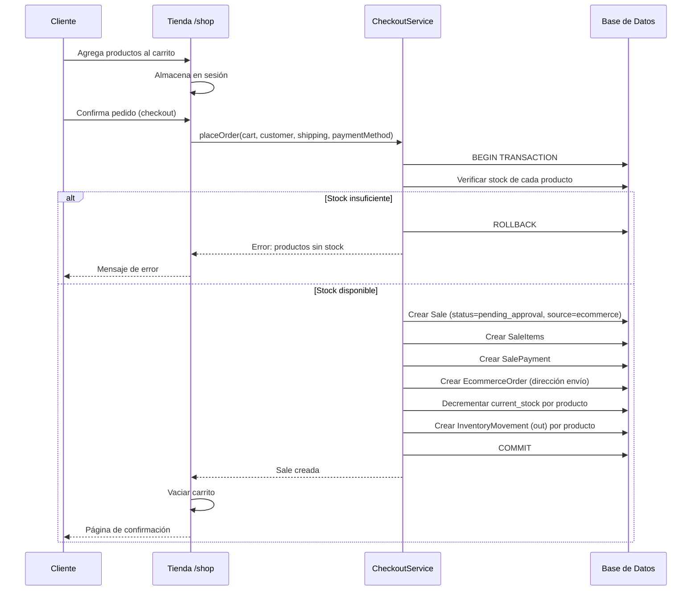
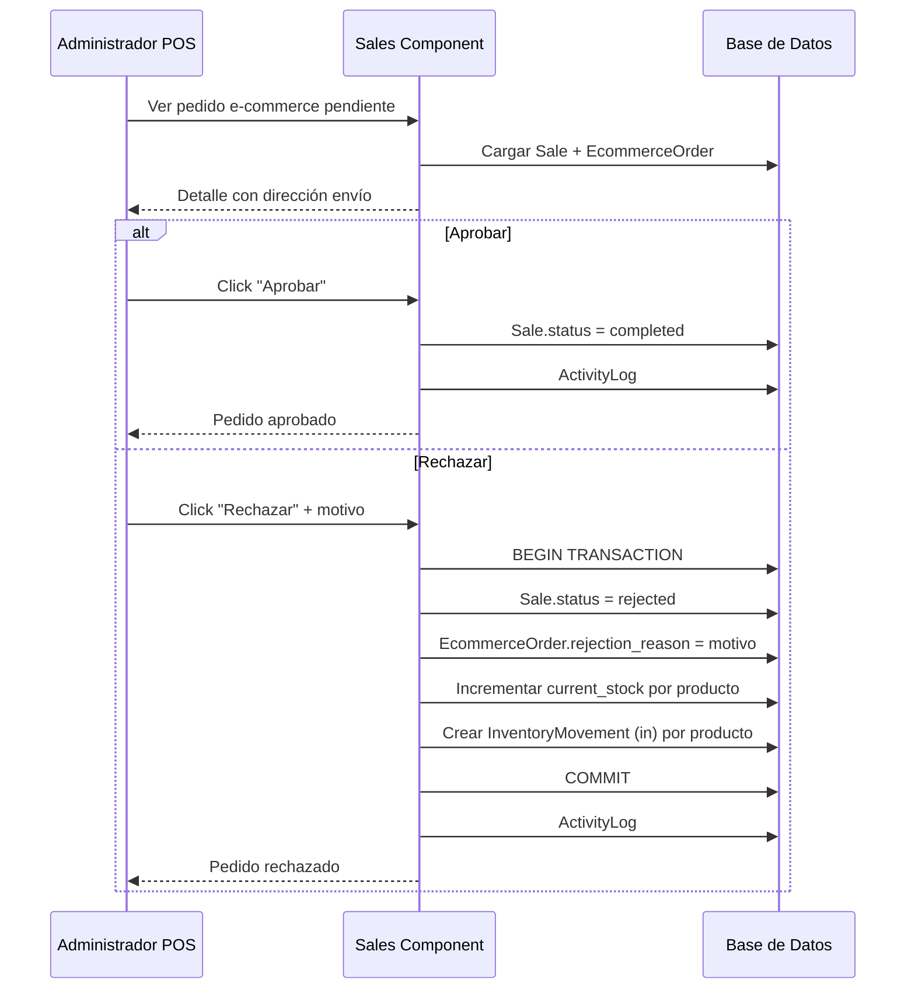
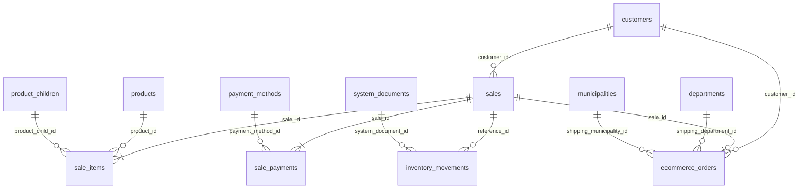

# Documento de Diseño — Módulo E-commerce

## Visión General

Este documento describe el diseño técnico del módulo de e-commerce para MikPOS. El módulo agrega una tienda en línea pública bajo el prefijo `/shop` con autenticación independiente para clientes, catálogo de productos, carrito de compras, checkout con reserva inmediata de stock, y gestión de pedidos desde el panel POS existente.

El diseño se integra nativamente con la arquitectura existente de MikPOS (Laravel 12, Livewire 3, Tailwind CSS 4, Alpine.js) reutilizando modelos, tablas y servicios ya existentes (`products`, `customers`, `sales`, `sale_items`, `sale_payments`, `inventory_movements`, `payment_methods`).

### Decisiones Clave de Diseño

1. **Guard independiente `customer`**: Se usa un guard de Laravel separado del `web` para aislar completamente la autenticación de clientes e-commerce de los usuarios del POS. El modelo `Customer` implementará `Authenticatable`.
2. **Misma tabla `customers`**: Se reutiliza la tabla existente agregando columnas `password`, `email_verified_at` y `remember_token`. Esto permite que clientes creados desde el POS puedan registrarse en la tienda y viceversa.
3. **Tabla `sales` con columna `source`**: Los pedidos e-commerce se almacenan como ventas normales con `source = 'ecommerce'` y `status = 'pending_approval'`, permitiendo reutilizar toda la lógica de ventas existente.
4. **Tabla `ecommerce_orders`**: Tabla complementaria para datos específicos de e-commerce (dirección de envío, motivo de rechazo) vinculada 1:1 con `sales`.
5. **Reserva inmediata de stock**: El stock se decrementa al confirmar el pedido (no al aprobar), usando transacciones DB para evitar sobreventa.
6. **Carrito en sesión**: El carrito se almacena en la sesión del cliente autenticado, sin tabla adicional.
7. **Variable `ECOMMERCE_BRANCH_ID`**: Configura qué sucursal alimenta la tienda, simplificando el filtrado de productos.

## Arquitectura

### Diagrama de Arquitectura General



### Flujo de Pedido E-commerce



### Flujo de Aprobación/Rechazo desde POS



## Componentes e Interfaces

### Componentes Livewire Nuevos (Tienda)

| Componente | Ruta | Layout | Guard | Descripción |
|---|---|---|---|---|
| `Shop\Auth\Login` | `/shop/login` | `layouts.shop` | `guest:customer` | Login de clientes |
| `Shop\Auth\Register` | `/shop/register` | `layouts.shop` | `guest:customer` | Registro de clientes |
| `Shop\Catalog` | `/shop` | `layouts.shop` | `customer` | Catálogo con búsqueda y filtros |
| `Shop\ProductDetail` | `/shop/product/{product}` | `layouts.shop` | `customer` | Detalle de producto con variantes |
| `Shop\Cart` | `/shop/cart` | `layouts.shop` | `customer` | Gestión del carrito |
| `Shop\Checkout` | `/shop/checkout` | `layouts.shop` | `customer` | Proceso de checkout |
| `Shop\OrderConfirmation` | `/shop/order/{sale}` | `layouts.shop` | `customer` | Confirmación post-compra |
| `Shop\Orders` | `/shop/orders` | `layouts.shop` | `customer` | Historial de pedidos |

### Componentes Livewire Modificados (POS)

| Componente | Cambio |
|---|---|
| `Sales` | Agregar filtros `source` y `status=pending_approval`. Botones aprobar/rechazar. Modal de dirección de envío. |

### Servicio Nuevo

**`EcommerceCheckoutService`** (`app/Services/EcommerceCheckoutService.php`)

```php
class EcommerceCheckoutService
{
    /**
     * Crea el pedido completo dentro de una transacción DB.
     * Retorna la Sale creada o lanza excepción si falla stock.
     */
    public function placeOrder(
        Customer $customer,
        array $cartItems,
        int $paymentMethodId,
        array $shippingData
    ): Sale;

    /**
     * Aprueba un pedido e-commerce pendiente.
     */
    public function approveOrder(Sale $sale): void;

    /**
     * Rechaza un pedido e-commerce y devuelve el stock.
     */
    public function rejectOrder(Sale $sale, string $reason): void;

    /**
     * Genera número de factura para e-commerce.
     */
    private function generateInvoiceNumber(int $branchId): string;

    /**
     * Valida stock disponible para todos los items del carrito.
     * Lanza excepción con detalle de productos sin stock.
     */
    private function validateStock(array $cartItems): void;

    /**
     * Decrementa stock y crea movimientos de inventario.
     */
    private function reserveStock(Sale $sale, array $cartItems): void;

    /**
     * Incrementa stock y crea movimientos de inventario inversos.
     */
    private function returnStock(Sale $sale): void;
}
```

### Middleware Nuevo

**`EcommerceAuth`** (`app/Http/Middleware/EcommerceAuth.php`)
- Verifica que el cliente esté autenticado con el guard `customer`
- Redirige a `/shop/login` si no está autenticado

### Layout Nuevo

**`layouts.shop`** (`resources/views/layouts/shop.blade.php`)
- Layout independiente del POS con header, navegación, carrito icon, y footer
- Usa Tailwind CSS con la paleta de colores de MikPOS
- Header: logo, búsqueda, enlace a carrito con badge de cantidad, nombre del cliente, logout
- Responsive con soporte móvil

### Estructura de Archivos

```
app/
├── Livewire/
│   └── Shop/
│       ├── Auth/
│       │   ├── Login.php
│       │   └── Register.php
│       ├── Catalog.php
│       ├── ProductDetail.php
│       ├── Cart.php
│       ├── Checkout.php
│       ├── OrderConfirmation.php
│       └── Orders.php
├── Http/
│   └── Middleware/
│       └── EcommerceAuth.php
├── Models/
│   └── EcommerceOrder.php
├── Services/
│   └── EcommerceCheckoutService.php
resources/views/
├── layouts/
│   └── shop.blade.php
├── livewire/
│   └── shop/
│       ├── auth/
│       │   ├── login.blade.php
│       │   └── register.blade.php
│       ├── catalog.blade.php
│       ├── product-detail.blade.php
│       ├── cart.blade.php
│       ├── checkout.blade.php
│       ├── order-confirmation.blade.php
│       └── orders.blade.php
database/
├── migrations/
│   ├── xxxx_add_ecommerce_fields_to_customers_table.php
│   ├── xxxx_add_source_to_sales_table.php
│   └── xxxx_create_ecommerce_orders_table.php
├── seeders/
│   └── EcommerceModuleSeeder.php
```


## Modelos de Datos

### Modificaciones a Modelos Existentes

#### Customer (modificado)

Se agrega `Authenticatable` al modelo `Customer` para soportar el guard `customer`.

```php
use Illuminate\Foundation\Auth\User as Authenticatable;

class Customer extends Authenticatable
{
    use HasFactory;

    protected $fillable = [
        // campos existentes...
        'password',
        'email_verified_at',
        'remember_token',
    ];

    protected $hidden = [
        'password',
        'remember_token',
    ];

    protected function casts(): array
    {
        return [
            // casts existentes...
            'email_verified_at' => 'datetime',
            'password' => 'hashed',
        ];
    }

    // Relación nueva
    public function ecommerceOrders(): HasMany
    {
        return $this->hasMany(EcommerceOrder::class);
    }

    public function sales(): HasMany
    {
        return $this->hasMany(Sale::class);
    }
}
```

**Migración `add_ecommerce_fields_to_customers_table`:**
```php
Schema::table('customers', function (Blueprint $table) {
    $table->string('password')->nullable()->after('email');
    $table->timestamp('email_verified_at')->nullable()->after('password');
    $table->rememberToken()->after('email_verified_at');
});
```

#### Sale (modificado)

Se agrega columna `source` y relación con `EcommerceOrder`.

```php
// Nuevos valores de $fillable
'source', // 'pos' | 'ecommerce'

// Nuevos status posibles: 'pending_approval', 'rejected' (además de los existentes)

// Relación nueva
public function ecommerceOrder(): HasOne
{
    return $this->hasOne(EcommerceOrder::class);
}

// Scope nuevo
public function scopeEcommerce(Builder $query): Builder
{
    return $query->where('source', 'ecommerce');
}

public function scopePendingApproval(Builder $query): Builder
{
    return $query->where('status', 'pending_approval');
}

public function isEcommerce(): bool
{
    return $this->source === 'ecommerce';
}

public function isPendingApproval(): bool
{
    return $this->status === 'pending_approval';
}
```

**Migración `add_source_to_sales_table`:**
```php
Schema::table('sales', function (Blueprint $table) {
    $table->string('source')->default('pos')->after('status');
});
```

### Modelo Nuevo: EcommerceOrder

```php
class EcommerceOrder extends Model
{
    use HasFactory;

    protected $fillable = [
        'sale_id',
        'customer_id',
        'shipping_department_id',
        'shipping_municipality_id',
        'shipping_address',
        'shipping_phone',
        'customer_notes',
        'rejection_reason',
    ];

    public function sale(): BelongsTo
    {
        return $this->belongsTo(Sale::class);
    }

    public function customer(): BelongsTo
    {
        return $this->belongsTo(Customer::class);
    }

    public function shippingDepartment(): BelongsTo
    {
        return $this->belongsTo(Department::class, 'shipping_department_id');
    }

    public function shippingMunicipality(): BelongsTo
    {
        return $this->belongsTo(Municipality::class, 'shipping_municipality_id');
    }
}
```

**Migración `create_ecommerce_orders_table`:**
```php
Schema::create('ecommerce_orders', function (Blueprint $table) {
    $table->id();
    $table->foreignId('sale_id')->constrained('sales')->cascadeOnDelete();
    $table->foreignId('customer_id')->constrained('customers')->cascadeOnDelete();
    $table->foreignId('shipping_department_id')->nullable()->constrained('departments')->nullOnDelete();
    $table->foreignId('shipping_municipality_id')->nullable()->constrained('municipalities')->nullOnDelete();
    $table->string('shipping_address')->nullable();
    $table->string('shipping_phone')->nullable();
    $table->text('customer_notes')->nullable();
    $table->text('rejection_reason')->nullable();
    $table->timestamps();
});
```

### Diagrama Entidad-Relación



### Configuración de Auth (config/auth.php)

```php
'guards' => [
    'web' => [
        'driver' => 'session',
        'provider' => 'users',
    ],
    'customer' => [
        'driver' => 'session',
        'provider' => 'customers',
    ],
],

'providers' => [
    'users' => [
        'driver' => 'eloquent',
        'model' => App\Models\User::class,
    ],
    'customers' => [
        'driver' => 'eloquent',
        'model' => App\Models\Customer::class,
    ],
],
```

### Configuración de Sucursal E-commerce

En `.env`:
```
ECOMMERCE_BRANCH_ID=1
```

En `config/ecommerce.php`:
```php
return [
    'branch_id' => env('ECOMMERCE_BRANCH_ID'),
];
```

Helper para acceder:
```php
// En cualquier componente o servicio
$branchId = config('ecommerce.branch_id');
```

### Estructura del Carrito (Sesión)

El carrito se almacena en `session('ecommerce_cart')` como array:

```php
[
    'items' => [
        [
            'product_id' => 5,
            'product_child_id' => null, // o ID de variante
            'name' => 'Producto X',
            'sku' => 'CAT-20240101-0001',
            'unit_price' => 50000.00,    // precio con impuesto
            'tax_rate' => 19.00,
            'quantity' => 2,
            'max_stock' => 10,           // stock disponible al agregar
            'image' => 'products/img.jpg',
        ],
    ],
    'updated_at' => '2024-01-15 10:30:00',
]
```

### Seeder: EcommerceModuleSeeder

```php
// Crea módulo 'ecommerce' con permisos:
// - ecommerce_orders.view
// - ecommerce_orders.approve
// - ecommerce_orders.reject

// Crea SystemDocument:
// - code: 'ecommerce-sale', prefix: 'ECM', name: 'Venta E-commerce'
```

### Rutas

```php
// routes/web.php - Grupo e-commerce

// Rutas públicas (guest:customer)
Route::prefix('shop')->middleware('guest:customer')->group(function () {
    Route::get('/login', Shop\Auth\Login::class)->name('shop.login');
    Route::get('/register', Shop\Auth\Register::class)->name('shop.register');
});

// Rutas protegidas (customer auth)
Route::prefix('shop')->middleware('ecommerce.auth')->group(function () {
    Route::get('/', Shop\Catalog::class)->name('shop.catalog');
    Route::get('/product/{product}', Shop\ProductDetail::class)->name('shop.product');
    Route::get('/cart', Shop\Cart::class)->name('shop.cart');
    Route::get('/checkout', Shop\Checkout::class)->name('shop.checkout');
    Route::get('/order/{sale}', Shop\OrderConfirmation::class)->name('shop.order');
    Route::get('/orders', Shop\Orders::class)->name('shop.orders');

    Route::post('/logout', function () {
        Auth::guard('customer')->logout();
        request()->session()->invalidate();
        request()->session()->regenerateToken();
        return redirect('/shop/login');
    })->name('shop.logout');
});
```


## Propiedades de Correctitud

*Una propiedad es una característica o comportamiento que debe mantenerse verdadero en todas las ejecuciones válidas de un sistema — esencialmente, una declaración formal sobre lo que el sistema debe hacer. Las propiedades sirven como puente entre especificaciones legibles por humanos y garantías de correctitud verificables por máquina.*

### Propiedad 1: Filtrado del catálogo por sucursal, estado y stock

*Para cualquier* conjunto de productos en la base de datos con distintos valores de `is_active`, `current_stock` y `branch_id`, el catálogo de la tienda debe retornar únicamente aquellos productos donde `is_active = true`, `current_stock > 0` y `branch_id` sea igual al `ECOMMERCE_BRANCH_ID` configurado.

**Valida: Requisitos 3.1, 10.2**

### Propiedad 2: Completitud de información del producto en catálogo

*Para cualquier* producto visible en el catálogo, la representación renderizada debe contener: nombre, precio de venta con impuesto, categoría, marca y stock disponible.

**Valida: Requisito 3.2**

### Propiedad 3: Búsqueda de productos por nombre, SKU o descripción

*Para cualquier* término de búsqueda que sea subcadena del nombre, SKU o descripción de un producto activo con stock, dicho producto debe aparecer en los resultados de búsqueda.

**Valida: Requisito 3.3**

### Propiedad 4: Filtrado por categoría y marca

*Para cualquier* filtro de categoría o marca aplicado al catálogo, todos los productos retornados deben pertenecer a la categoría o marca seleccionada, y ningún producto de otra categoría/marca debe aparecer.

**Valida: Requisito 3.4**

### Propiedad 5: Variantes activas en detalle de producto

*Para cualquier* producto que tenga `product_children` con `is_active = true`, la página de detalle debe mostrar cada variante activa con su stock individual. Las variantes inactivas no deben aparecer.

**Valida: Requisito 3.5**

### Propiedad 6: Registro crea cliente válido

*Para cualquier* conjunto de datos de registro válidos (email único, documento único por tipo, contraseña válida), el sistema debe crear un registro en `customers` con `password` hasheado con bcrypt, `branch_id` igual al `ECOMMERCE_BRANCH_ID` configurado, y todos los campos del formulario correctamente almacenados.

**Valida: Requisito 2.2**

### Propiedad 7: Unicidad de email y documento en registro

*Para cualquier* intento de registro con un email que ya existe en `customers`, o con una combinación `document_number` + `tax_document_id` que ya existe, el sistema debe rechazar el registro y no crear ningún registro nuevo.

**Valida: Requisito 2.3**

### Propiedad 8: Autenticación con credenciales válidas

*Para cualquier* cliente registrado con email y contraseña conocidos, al proporcionar esas credenciales en el login, el sistema debe autenticar al cliente usando el guard `customer` y el guard `web` no debe estar autenticado.

**Valida: Requisito 2.4**

### Propiedad 9: Credenciales inválidas producen error genérico

*Para cualquier* combinación de credenciales inválidas (email inexistente, contraseña incorrecta), el mensaje de error retornado debe ser idéntico sin revelar si el email existe o no en el sistema.

**Valida: Requisito 2.5**

### Propiedad 10: Agregar producto al carrito

*Para cualquier* producto activo con stock disponible, al agregarlo al carrito, el carrito debe contener ese producto con cantidad 1 y el número total de items distintos en el carrito debe incrementar en 1.

**Valida: Requisito 4.1**

### Propiedad 11: Límite de stock en carrito

*Para cualquier* producto con `current_stock = S` y cualquier cantidad solicitada `Q > S`, el carrito debe limitar la cantidad a `S` y no permitir que exceda el stock disponible.

**Valida: Requisito 4.2**

### Propiedad 12: Recálculo de totales del carrito

*Para cualquier* carrito con N items, al modificar la cantidad de un item o eliminar un item, el total del carrito debe ser igual a la suma de `(unit_price * quantity)` de todos los items restantes.

**Valida: Requisitos 4.3, 4.4**

### Propiedad 13: Badge del carrito refleja cantidad de items

*Para cualquier* estado del carrito, el indicador visual (badge) en el header debe mostrar un número igual a la cantidad total de items distintos en el carrito. Si el carrito está vacío, el badge no debe mostrarse o debe mostrar 0.

**Valida: Requisito 4.6**

### Propiedad 14: Solo métodos de pago activos en checkout

*Para cualquier* conjunto de métodos de pago con distintos valores de `is_active`, el checkout debe mostrar únicamente aquellos donde `is_active = true`.

**Valida: Requisito 5.2**

### Propiedad 15: Creación completa del pedido (round trip)

*Para cualquier* carrito válido (no vacío, stock suficiente), datos de envío y método de pago activo, al confirmar el pedido el sistema debe crear: (a) un `Sale` con `status = 'pending_approval'`, `source = 'ecommerce'`, `payment_type = 'cash'`, (b) un `SaleItem` por cada item del carrito con cantidades y precios correctos, (c) un `SalePayment` con el método de pago seleccionado y monto total, y (d) un `EcommerceOrder` con los datos de envío y referencia al `sale_id`.

**Valida: Requisitos 5.3, 5.4, 5.5**

### Propiedad 16: Carrito vacío después de pedido exitoso

*Para cualquier* pedido creado exitosamente, la sesión del cliente debe tener el carrito vacío (sin items).

**Valida: Requisito 5.7**

### Propiedad 17: Reserva de stock al confirmar pedido

*Para cualquier* pedido confirmado con N items, el `current_stock` de cada producto debe decrementarse exactamente por la cantidad ordenada, y debe existir exactamente un `InventoryMovement` con `movement_type = 'out'` por cada item, con `system_document.code = 'ecommerce-sale'` y referencia al `Sale`.

**Valida: Requisitos 6.1, 6.2**

### Propiedad 18: Atomicidad ante stock insuficiente

*Para cualquier* carrito donde al menos un producto tiene `current_stock` menor que la cantidad solicitada, al intentar confirmar el pedido: no debe crearse ningún `Sale`, no debe crearse ningún `SaleItem`, no debe modificarse el `current_stock` de ningún producto, no debe crearse ningún `InventoryMovement`, y el carrito debe permanecer intacto.

**Valida: Requisitos 6.3, 6.4**

### Propiedad 19: Pedidos del cliente ordenados por fecha descendente

*Para cualquier* cliente con pedidos, la página "Mis Pedidos" debe mostrar únicamente los pedidos de ese cliente (no de otros clientes) y deben estar ordenados del más reciente al más antiguo.

**Valida: Requisito 7.1**

### Propiedad 20: Filtro de origen en módulo de Ventas

*Para cualquier* valor del filtro de origen ("pos", "ecommerce", "todos"), el listado de ventas debe retornar únicamente las ventas cuyo campo `source` coincida con el filtro, o todas si el filtro es "todos".

**Valida: Requisito 8.1**

### Propiedad 21: Aprobación cambia estado a completed

*Para cualquier* pedido e-commerce con `status = 'pending_approval'`, al aprobarlo, el `status` debe cambiar a `completed` y debe registrarse un log de actividad.

**Valida: Requisito 8.4**

### Propiedad 22: Validación del motivo de rechazo

*Para cualquier* cadena de texto con menos de 10 caracteres proporcionada como motivo de rechazo, el sistema debe rechazar la operación y no modificar el estado del pedido.

**Valida: Requisito 8.5**

### Propiedad 23: Rechazo con devolución de stock

*Para cualquier* pedido e-commerce con `status = 'pending_approval'` y un motivo de rechazo válido (≥10 caracteres), al rechazarlo: (a) el `status` debe cambiar a `rejected`, (b) el `rejection_reason` debe almacenarse en `ecommerce_orders`, (c) el `current_stock` de cada producto debe incrementarse por la cantidad del item, (d) debe crearse un `InventoryMovement` con `movement_type = 'in'` por cada item, y (e) debe registrarse un log de actividad.

**Valida: Requisitos 8.6, 8.7**

## Manejo de Errores

### Errores de Stock

| Escenario | Comportamiento |
|---|---|
| Stock insuficiente al confirmar pedido | Rollback completo de la transacción. Mensaje al cliente indicando qué productos no tienen stock suficiente. Carrito intacto. |
| Stock agotado mientras el producto está en carrito | Al intentar checkout, validación previa detecta el problema. Mensaje indicando actualizar cantidades. |
| Producto desactivado mientras está en carrito | Al intentar checkout, el producto se excluye y se notifica al cliente. |

### Errores de Autenticación

| Escenario | Comportamiento |
|---|---|
| Credenciales inválidas | Mensaje genérico: "Las credenciales proporcionadas son incorrectas." Sin revelar si el email existe. |
| Sesión expirada | Redirección a `/shop/login` con mensaje de sesión expirada. |
| Cliente intenta acceder a ruta POS | Redirección a `/shop/login`. |
| Usuario POS intenta acceder a ruta Shop | Requiere login con credenciales de cliente. |

### Errores de Registro

| Escenario | Comportamiento |
|---|---|
| Email duplicado | Mensaje: "Este correo electrónico ya está registrado." |
| Documento duplicado por tipo | Mensaje: "Este número de documento ya está registrado para este tipo de documento." |
| Campos requeridos faltantes | Mensajes de validación estándar de Laravel por campo. |

### Errores de Configuración

| Escenario | Comportamiento |
|---|---|
| `ECOMMERCE_BRANCH_ID` no configurado | Página informativa: "La tienda no está disponible temporalmente." |
| Sucursal configurada no existe o está inactiva | Misma página informativa. |

### Errores de Gestión de Pedidos (POS)

| Escenario | Comportamiento |
|---|---|
| Motivo de rechazo < 10 caracteres | Validación impide el rechazo. Mensaje indicando mínimo 10 caracteres. |
| Error en transacción de devolución de stock | Rollback completo. Pedido permanece en `pending_approval`. Notificación de error al admin. |

## Estrategia de Testing

### Enfoque Dual: Tests Unitarios + Tests de Propiedades

El módulo e-commerce requiere ambos tipos de tests para cobertura completa:

- **Tests unitarios**: Verifican ejemplos específicos, edge cases y condiciones de error.
- **Tests de propiedades (PBT)**: Verifican propiedades universales con inputs generados aleatoriamente.

### Librería de Property-Based Testing

Se usará **[PHPUnit con `phpunit/phpunit`](https://phpunit.de/)** como framework base y **[`innmind/black-box`](https://github.com/Innmind/BlackBox)** como librería de property-based testing para PHP, que se integra con PHPUnit.

Alternativa: Si `innmind/black-box` no es viable, usar **generadores manuales con loops de 100+ iteraciones** dentro de PHPUnit, generando datos aleatorios con `fake()` de Laravel.

### Configuración de Tests de Propiedades

- Mínimo **100 iteraciones** por test de propiedad.
- Cada test debe incluir un comentario referenciando la propiedad del diseño:
  ```php
  // Feature: ecommerce-module, Property 17: Reserva de stock al confirmar pedido
  ```
- Cada propiedad de correctitud debe ser implementada por un **único test de propiedad**.

### Tests Unitarios (Ejemplos y Edge Cases)

| Test | Tipo | Valida |
|---|---|---|
| Registro con datos válidos crea cliente | Ejemplo | Req 2.2 |
| Login con credenciales correctas autentica | Ejemplo | Req 2.4 |
| Logout invalida sesión | Ejemplo | Req 2.6 |
| Checkout con carrito vacío redirige | Edge case | Req 5.6 |
| Tienda no disponible sin branch configurado | Edge case | Req 10.3 |
| Detalle de pedido rechazado muestra motivo | Ejemplo | Req 7.4 |
| Filtro pending_approval en Sales | Ejemplo | Req 8.2 |
| Detalle de pedido e-commerce muestra botones | Ejemplo | Req 8.3 |
| Migraciones crean columnas correctas | Ejemplo | Reqs 9.1-9.5 |
| Guard customer aislado del guard web | Ejemplo | Reqs 1.3, 1.4 |

### Tests de Propiedades (PBT)

| Test | Propiedad | Iteraciones |
|---|---|---|
| Catálogo filtra por branch, activo y stock | P1 | 100 |
| Búsqueda por nombre/SKU/descripción | P3 | 100 |
| Filtro por categoría/marca | P4 | 100 |
| Registro rechaza email/documento duplicado | P7 | 100 |
| Credenciales inválidas dan error genérico | P9 | 100 |
| Agregar al carrito incrementa items | P10 | 100 |
| Carrito limita cantidad a stock | P11 | 100 |
| Totales del carrito se recalculan | P12 | 100 |
| Creación completa del pedido | P15 | 100 |
| Reserva de stock al confirmar | P17 | 100 |
| Atomicidad ante stock insuficiente | P18 | 100 |
| Pedidos ordenados por fecha desc | P19 | 100 |
| Filtro de origen en Ventas | P20 | 100 |
| Rechazo con devolución de stock | P23 | 100 |

### Estructura de Archivos de Tests

```
tests/
├── Feature/
│   └── Ecommerce/
│       ├── AuthTest.php              # Login, registro, logout, guard isolation
│       ├── CatalogTest.php           # Filtrado, búsqueda, categoría/marca
│       ├── CartTest.php              # Agregar, modificar, eliminar, totales
│       ├── CheckoutTest.php          # Creación de pedido, stock, atomicidad
│       ├── OrdersTest.php            # Historial, detalle, rechazo visible
│       ├── AdminOrdersTest.php       # Aprobar, rechazar, filtros en Sales
│       └── ConfigurationTest.php     # Branch config, migraciones
├── Unit/
│   └── Ecommerce/
│       └── CheckoutServiceTest.php   # EcommerceCheckoutService unit tests
```
